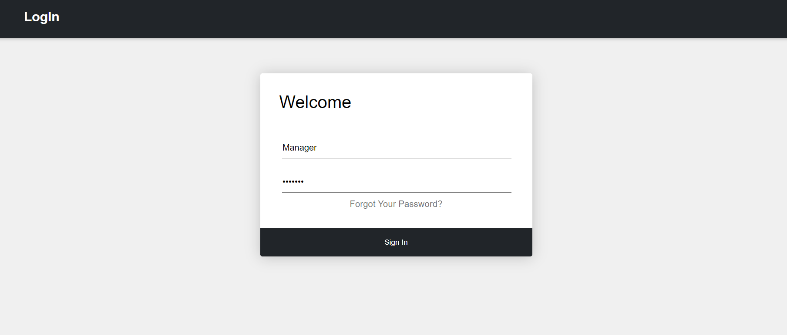
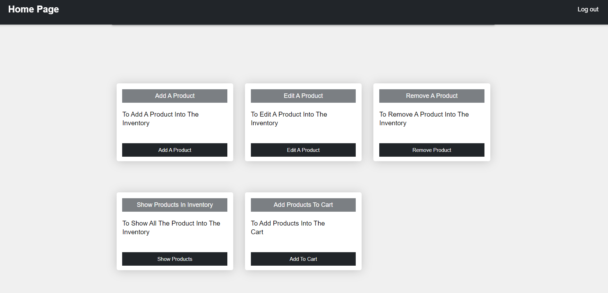
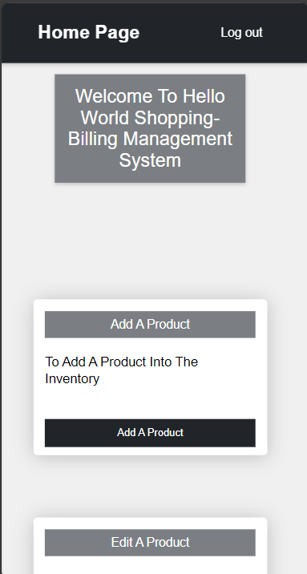
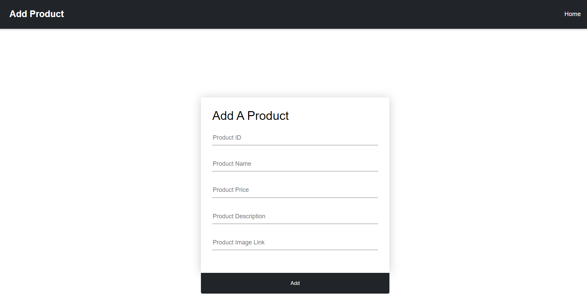
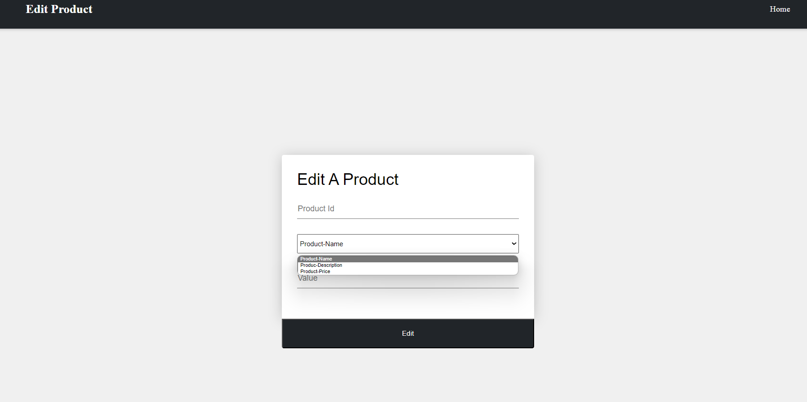
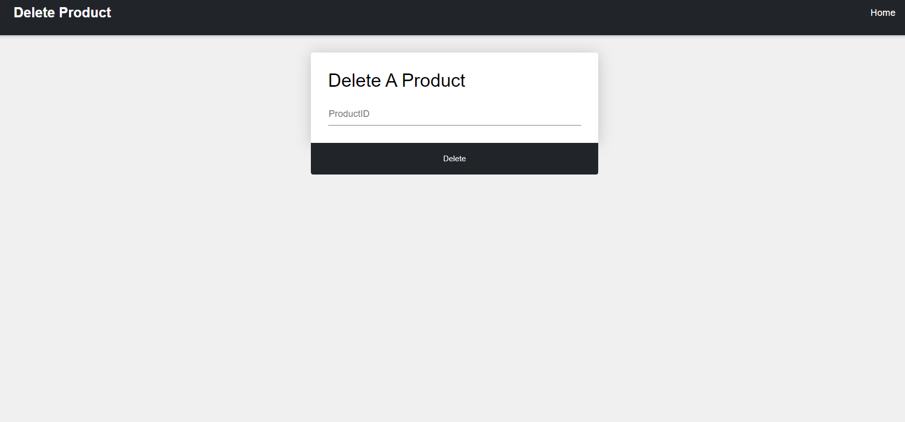
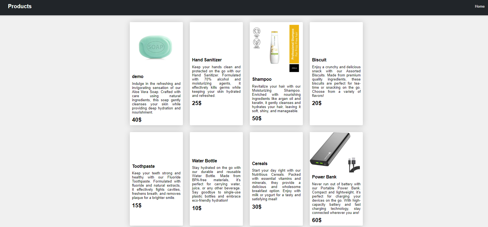
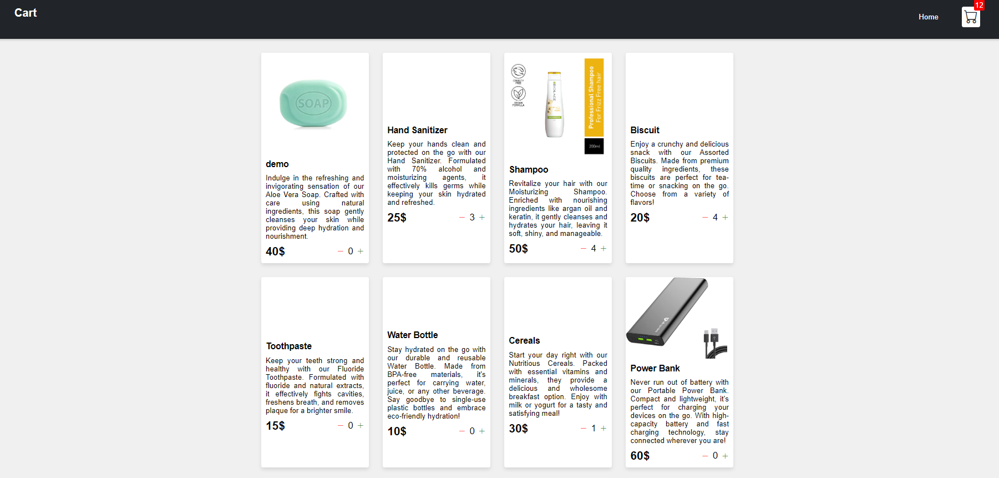
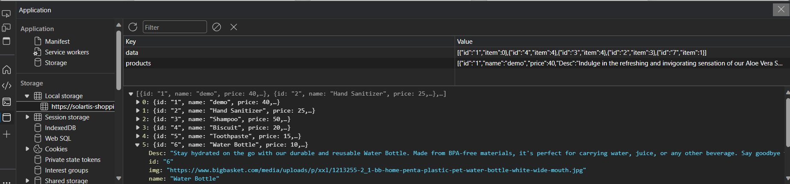

# Shopping Billing Management 

## Front-End
### Key Features


1. Add Product: Ability to add new products to the inventory with details such as product ID, name, price, description, and image link.

2. Edit Product: Allows modification of existing product details including name, description, and price.

3. Delete Product: Capability to remove products from the inventory using productID.

4. View Products: Provides a comprehensive list of all available products in the inventory.

5. Shopping Cart: Allows users to add products to their cart for potential purchase. The cart utilizes __local storage__ to ensure that even if the webpage is refreshed, the data in the cart remains intact.

6. Null Field Validation: Implemented __JavaScript validation__ to ensure that all required fields are filled out before adding, editing, or deleting a product.This helps to prevent unintended behavior when submitting data and ensures data accuracy.

7. Responsive Design: Show Products In Inventory  and Add Products To Cart are optimized for various screen sizes using __media queries__

### Live Demo and Website Deployment 
- **Live Demo:** [Link to the deployed website](https://solartis-shoppingbilling-management.netlify.app/)
- **Deployment:** The following site  is deployed using **Netlify** services 


###  Source Code Repository
- **GitHub Repository:** [Link to the GitHub repository](https://github.com/Murugappankrishna/Solartis_Front_End_final)

- **To Get The File**- `git clone https://github.com/Murugappankrishna/Solartis_Front_End_final.git`

### Quick Start
- once the git repository is cloned locate the file ``login.html`` in the path ``Solartis_Front_End_final/login/login.html`` and run it in your browser

### User Interface/Features Screenshots
- Login Page

- Home Page


- Responsive Home Page
  


- Code Implementation
  
```
@media (max-width: 1000px) {
  .container {
    grid-template-columns: repeat(2, 233px);
  }
}
```

```
@media (max-width: 500px) {
  .container {
    grid-template-columns: repeat(1, 233px);
  }
```
- Add Products Page

- Edit Products Page

- Remove Product

- View All Products

- Cart Page

- Responsive Cart Page


- Usage Of Local Storage


- Code Implementation 
```
shopItems = JSON.parse(localStorage.getItem("products"));
```

```
if (!localStorage.getItem("products")) {
  localStorage.setItem("products", JSON.stringify(shopItemsData));
}
```

